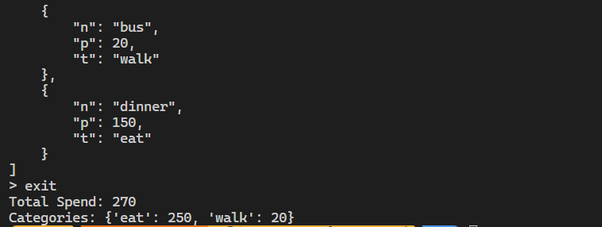

# 台科大資管 Python 實作作業作答區

---

## 基本資料

學號： B11xxxxxx
系級： 資管系大一
姓名： 王小明

## 一、 原始碼分析報告 (Static Analysis) (20%)

### 變數與邏輯對照表

| 變數名稱  | 商業意義                          | 說明                                                                 |
|-----------|-----------------------------------|----------------------------------------------------------------------|
| a         | 收入或支出金額                   | 該變數用於儲存使用者輸入的金額，未明確命名，易造成混淆。             |
| b         | 記帳日期                          | 該變數用於儲存日期資訊，但未使用標準化格式，且命名不具可讀性。       |
| cate_dict | 類別字典 (如：食物、交通、娛樂)  | 該變數用於對應記帳類別的名稱與代碼，命名不清楚，且未使用標準資料結構。|

### 壞味道 (Code Smells) 診斷

請列出原程式碼中至少 5 個嚴重的設計問題，並說明為什麼不好

1. **命名不清楚**
   - 問題：變數名稱如 `a`、`b`、`cate_dict` 缺乏語意，無法直觀理解其用途。
   - 影響：降低程式碼可讀性，增加維護成本。

2. **缺乏模組化**
   - 問題：所有邏輯集中在一個檔案中，未拆分為函式或類別。
   - 影響：程式碼難以重用，且不利於單元測試。

3. **資料儲存格式混亂**
   - 問題：使用純文字檔案儲存資料，缺乏結構化。
   - 影響：難以進行資料解析與擴展，且容易出現格式錯誤。

4. **缺乏錯誤處理**
   - 問題：未處理使用者輸入錯誤或檔案讀取失敗的情況。
   - 影響：程式容易因例外情況崩潰，降低穩定性。

5. **效能低下**
   - 問題：每次新增記錄都會重新寫入整個檔案。
   - 影響：當資料量增大時，會導致程式執行效率低下。
> 可參考以下 Code Smells！

1. Line 3~4 全局變數（壞習慣 1：隨意使用全局變數）
2. Line 7,11 # 壞習慣 2：神祕的變數命名，完全看不懂 a, b, c 是什麼
3. Line 11 # 壞習慣 3：硬編碼的索引，且混雜了字串與型別轉換 # 這裡的邏輯是：項目/金額/類別
4. Line 16,18 # 壞習慣 4：極其低效的檔案寫法，每次存檔都重新開啟並用奇怪的格式
5. Line 25,26 # 壞習慣 5：手動解析混亂的格式，容易出錯
6. Line 36 # 壞習慣 6：完全沒有防錯機制，輸入空白或格式不對會直接 Crash
7. Line 39 # 壞習慣 7：在結束時才做複雜運算，且邏輯重複 # 統計分類邏輯寫得非常混亂
8. Line 51 # 壞習慣 8：字串切割邏輯脆弱
9. Line 60 # 壞習慣 9：排版混亂，沒有格式化輸出
10. Line 64 # 壞習慣 10：隱藏功能（未說明的後門）

---

## 二、 Vibe-Coding 協作紀錄 (30%)

請記錄你如何引導 GitHub Copilot 進行重構。

### 1. 關鍵 Prompt 紀錄

請貼出你對 AI 下達過最有效的 3 個 Prompt：

```log
1. **模組化**
   Prompt: 「請將記帳系統的功能拆解為類別與函式，並提供清晰的程式結構。」

2. **格式升級**
   Prompt: 「請將資料儲存格式從 TXT 改為 JSON，並提供讀取與儲存的實作範例。」

3. **強健性**
   Prompt: 「請增加錯誤處理邏輯，避免因檔案不存在或輸入錯誤導致程式崩潰。」
```

### 2. AI 錯誤處理

## 修正過程

- 初始程式碼中，AI 忘記處理 JSONDecodeError，導致檔案損壞時無法正常載入資料。
- 修正後，加入 `except json.JSONDecodeError`，確保程式穩定性。

---

## 三、 成果驗證與測試 (30%)

確保你的 `refined_tracker.py` 功能正確。

### 1. 測試結果截圖 (Terminal)

>> 

請貼上執行程式並輸入 show 後，顯示資料清單的截圖（或文字紀錄）。

### 2. 產出的資料檔案格式

請貼上重構後生成的 records.json 前幾行內容：

```json
[
    {"n": "breakfast", "p": 100, "t": "eat"}, 
    {"n": "bus", "p": 20, "t": "walk"}, 
    {"n": "dinner", "p": 150, "t": "eat"}
]
```

## 四、 Git 提交紀錄 (Commit History) (20%)

請執行 git log --oneline 並將最近的筆紀錄貼在此處，以證明你的開發流程。

```log
10a7ca3 (HEAD -> master) doc: Example answer
ebfcbd2 (origin/master, origin/HEAD) Init Commit
```

請附上你的 GitHub Repository 連結：

```log
https://github.com/fan9704/NTUST-Final
```
